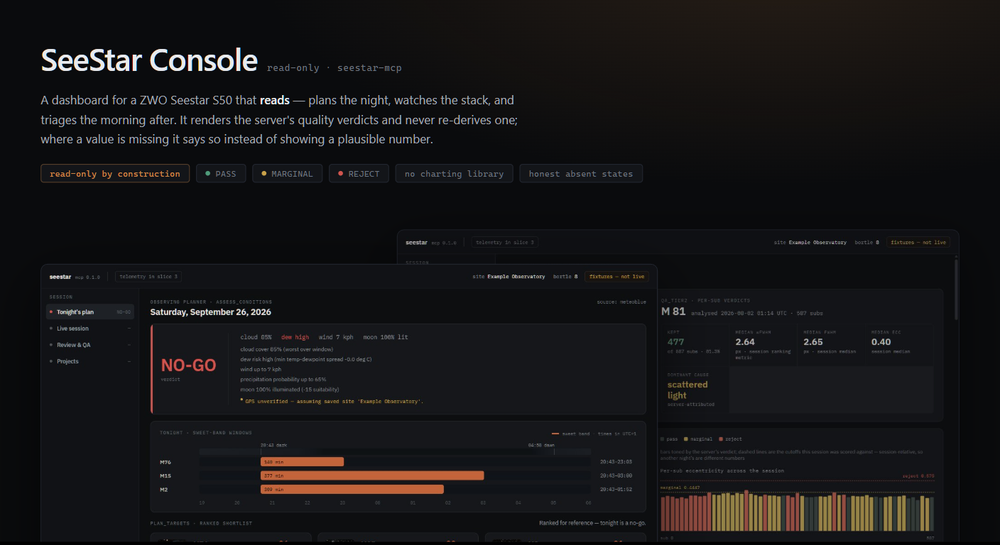
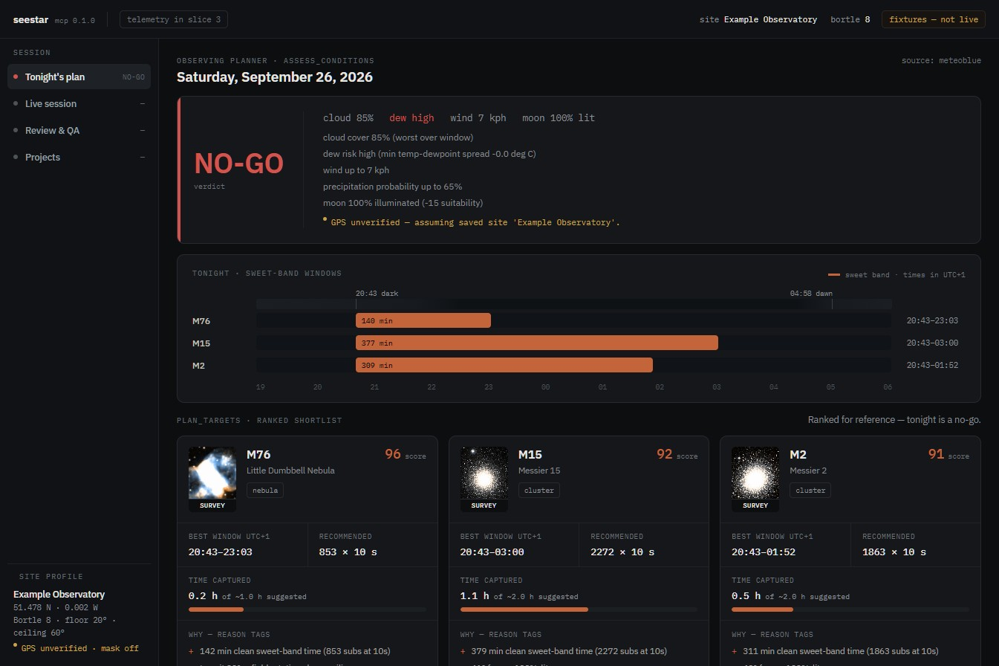
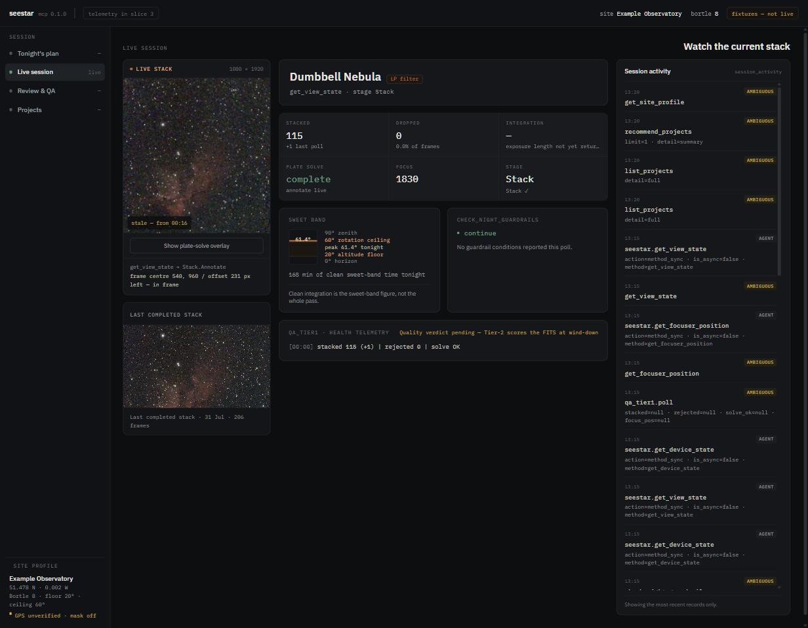
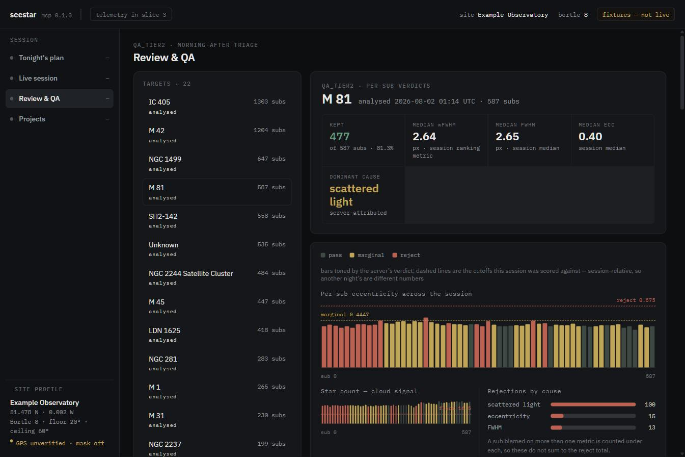
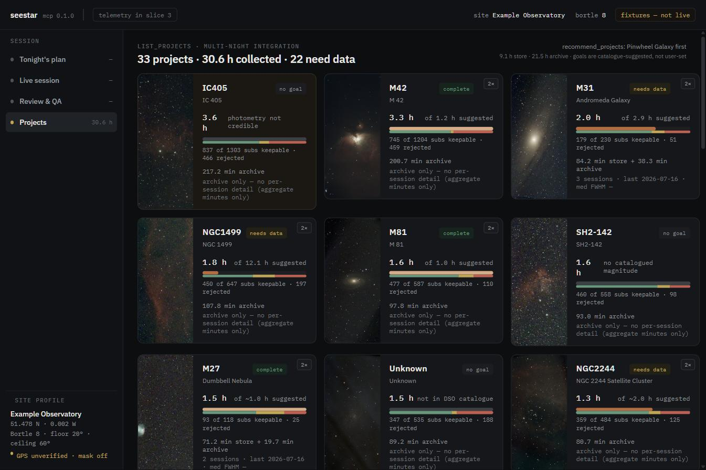

<p align="center">
  
</p>

# SeeStar Console

A read-only web dashboard for a **ZWO Seestar S50**. It plans the night, watches
the stack while it runs, and triages the morning after — reading the
[`seestar-mcp`](https://github.com/OrangeAgente/seestar-mcp) tool surface and
presenting it. **It does not control the telescope.**

Two rules shape almost every decision in here:

- **The UI renders verdicts; it never computes one.** PASS / MARGINAL / REJECT
  and the thresholds behind them belong to the server. No cutoff is hardcoded
  in the client — [a test fails the build](web/src/test/no-thresholds.test.ts)
  if one appears, comments and test inputs included.
- **A missing value is said out loud.** Where the tools don't return something,
  the screen shows that it's absent rather than a plausible-looking number. An
  empty bar reads as "nothing passed"; the truth is usually "nobody measured".

Screenshots below are from `SEESTAR_REPLAY=1` against the checked-in fixtures,
so they show a synthetic site rather than anyone's back garden.

---

## The screens

### Tonight's plan
Go / no-go from the weather, the sweet-band window per target, and a ranked
shortlist with the server's own reasoning attached to each card.



### Live session
The camera view while it stacks — frames kept and dropped, plate-solve state,
focus, the current stage, and the guardrail verdict. The preview says when a
frame is stale rather than presenting it as current. The activity feed
attributes every call to the client that made it.



> This one shot is older than the other three: re-taking it needs the scope
> awake on the LAN, since the preview reads its SMB share. The layout and the
> data are current; only the activity feed's origin tags have changed since,
> from an inferred `ambiguous` to a named `this console` / `agent`.

### Review & QA
Morning-after triage over `qa_tier2`: per-sub eccentricity and star count
across the session, the cutoffs that session was actually scored against, and
an evidence table carrying the server's own justification for every verdict.
Click a row to see the frame it's talking about.



### Projects
Multi-night integration per target, and — under it — how much of that time is
actually keepable. A target can sit at 100% of its suggested integration and
still be mostly rejects.



---

## Run it

You need **Node 20+**, **Python 3.11 or 3.12** (the sidecar pins
`>=3.11,<3.13`), and [**uv**](https://docs.astral.sh/uv/). A telescope is
optional — see the replay note below.

The sidecar serves both the API and the built frontend on one port — there is
no separate dev server to run in production.

```
cd web && npm install && npm run build
cd ../sidecar && uv sync
uv run seestar-dashboard
```

Then open **http://localhost:8787**.

**Try it with no telescope attached:** `SEESTAR_REPLAY=1 uv run seestar-dashboard`
serves the checked-in fixtures instead of spawning the MCP server, and the top
bar shows a "fixtures — not live" badge. That is how the screenshots above were
taken, and it's the fastest way to see whether this is useful to you.

On Windows, double-click **`run.bat`** at the repo root instead of typing the
last command — it `cd`s into `sidecar/` and runs the same thing. Drag it to
the desktop (right-click → Send to → Desktop, create shortcut) for a one-click
icon that doesn't require a terminal.

If `web/dist` hasn't been built yet, the sidecar still starts and `/api/*`
still works — `/` serves a plain-text reminder to run `npm run build` instead
of crashing.

### Options

Set these once by copying [`.env.example`](.env.example) to `.env` in the
repo root and filling in what you need — a real environment variable still
overrides `.env` if you set one, but `.env` is what makes the settings
persist across a new terminal, or a double-clicked `run.bat` shortcut with
no terminal at all. Full reference, including what happens when each is
unset and per-OS examples: [`docs/configuration.md`](docs/configuration.md).
Short version:

- **Port:** `uv run seestar-dashboard --port 9001`, or set `SEESTAR_PORT`.
  The default is **8787**, chosen to sit clear of the ports most likely to be
  busy already (8000, 8080, 8888, 5000, 3000). If it's taken anyway, the
  launcher prints which port is blocked and exits cleanly rather than a stack
  trace. The Vite dev server reads the same `SEESTAR_PORT`, so one change
  moves both.
- **Offline / no telescope attached:** `SEESTAR_REPLAY=1` — see above.
- **`seestar-mcp` checkout location:** set `SEESTAR_AI_DIR` to it — the
  sidecar spawns `seestar_mcp.server` from there. No personal-machine
  default: unset, the sidecar still boots, but every tool-backed route 502s
  with a message naming the variable until it's set (or you run with
  `SEESTAR_REPLAY=1` instead).
- **Photo archive location:** set `SEESTAR_ARCHIVE_DIR` to your Seestar
  archive directory. No personal-machine default here either: unset, the
  sidecar still boots and serves the store's own data — `/api/projects_combined`
  reports an `archive_status` field so the UI can tell "not configured" apart
  from "configured, but that path doesn't exist" and "configured and
  genuinely empty".

---

## How it's put together

A browser cannot speak MCP over stdio, so a small **FastAPI sidecar** spawns
`seestar_mcp.server` and exposes it over HTTP:

```
browser ──HTTP──▶ sidecar ──MCP/stdio──▶ seestar-mcp ──Alpaca──▶ Seestar S50
                     │
                     └── local reads: photo archive, DSO catalogue, provenance log
```

**The route allowlist is the read-only guarantee, and it is structural rather
than a check.** A tool with side effects has *no route at all* — `park`,
`goto_target`, `shutdown` and `qa_session_report` return 404 because nothing is
registered for them, not because a guard says no. A test asserts the registered
route set equals exactly the allowlist, so an undeclared route fails the build
whether or not anyone thought to name it.

One route mutates: `qa_analysis_start`, which launches a minutes-long QA pass.
It's POST, requires a custom header and checks its Origin, because a GET that
spends minutes of CPU is reachable from any page you happen to have open.

Other decisions worth knowing before reading the code:

- **No charting library.** The timeline, sweet-band gauge and per-sub charts
  are absolutely-positioned and flex divs driven by the token table. A chart
  library fights both.
- **Fixtures are recordings, not fabrications.** `fixtures/*.json` come off the
  real server, and are re-recorded whenever the contract version moves — a
  green suite pinning a stale recording is indistinguishable from a passing
  contract until the day it isn't. One deliberate exception: the site block in
  `get_site_profile.json` is replaced with Greenwich, because the real one
  located a house to about ten metres. `fixtures/synthetic/` holds hand-built
  payloads for states that can't be recorded on demand, and is named that way
  so nobody mistakes them for recordings. See
  [`fixtures/README.md`](fixtures/README.md).
- **Contract-pinned.** The client records which
  [`seestar-mcp` contract version](https://github.com/OrangeAgente/seestar-mcp/blob/main/docs/CONTRACT.md)
  it was written against (`SEESTAR_MCP_CONTRACT_VERSION` in
  `web/src/api/schemas.ts`), so drift is diffed rather than discovered.

### The hand-back rule

If a screen needs data the tools don't return, that's a **server change** and
it belongs in the `seestar-mcp` repo — not worked around in the client. The
running list of those gaps is
[`docs/handback-to-seestar-ai.md`](docs/handback-to-seestar-ai.md). Several
items on it have since shipped upstream, which is the rule working.

---

## Development

Two terminals, with live reload on the frontend:

```
cd sidecar && uv run uvicorn seestar_sidecar.main:create_app --factory --port 8787
cd web && npm run dev
```

Vite's dev server (`http://localhost:5173`) proxies `/api/*` to the sidecar
and the sidecar's CORS middleware allows that origin — neither is used once
`npm run build` + the single-process command above are in play.

### Tests

```
cd sidecar && uv run pytest
cd web && npm test && npm run build
```

Both `npm test` and `npm run build` must pass — `noUnusedLocals` means a green
test suite alone doesn't prove the build is clean. Note that `npx tsc --noEmit`
checks *nothing* here: the root `tsconfig.json` is a solution file with
`"files": []`. Use `tsc -b`, which `npm run build` runs.

## Repo layout

- `sidecar/` — FastAPI service proxying the MCP server over stdio behind a
  route allowlist (`seestar_sidecar/allowlist.py`). Never add a route for a
  tool with side effects.
- `web/` — React + TypeScript client; four screens.
- `fixtures/` — recorded tool payloads, used by `SEESTAR_REPLAY=1` and by the
  test suites. `fixtures/synthetic/` holds hand-built ones, labelled as such.
- `data/` — the DSO catalogue and alias index, with the script that generates
  them.
- `docs/design/` — the design system and per-screen specs (authority on
  tokens, layout and copy).
- `docs/superpowers/specs/` — approved implementation specs, one per slice.
- `docs/handback-to-seestar-ai.md` — server-side gaps this repo cannot fix
  itself.
- `docs/configuration.md` — every environment variable the sidecar reads,
  what happens when it's unset, and examples for Windows/macOS/Linux.
- `docs/screenshots/` — the images above. `_hero.html` regenerates the hero;
  open it and screenshot it rather than editing the PNG.

## Licence

**MIT** — see [`LICENSE`](LICENSE), which also records the two sets of files it
does *not* cover.

IBM Plex Sans and IBM Plex Mono are self-hosted under
`web/public/fonts/` (SIL Open Font License 1.1 — see the `LICENSE.txt` next to
each family's files).

The DSO catalogue in `data/` is derived from
[OpenNGC](https://github.com/mattiaverga/OpenNGC) and is licensed
**CC BY-SA 4.0**; see the provenance header in `data/dso_catalog_extended.json`
and the generating script `data/build_catalogue.py`.
